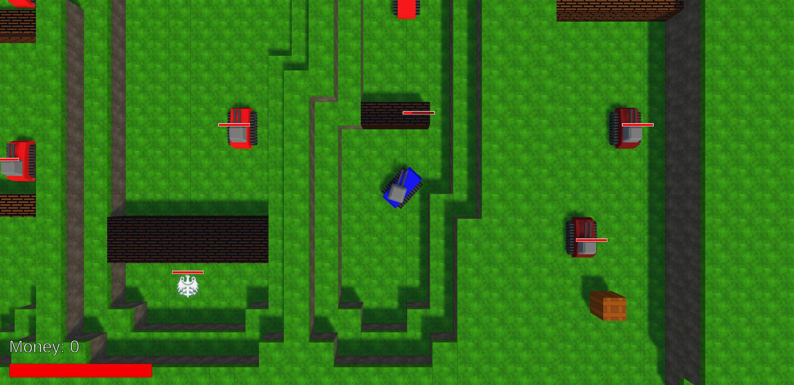

## 5th semester programming class project.
Unity version: 6000.0.29f1 
You need to have Blender installed because the game uses *.blend files to store models.

## The game
You drive a tank. The main goal of the game is to destroy all enemy bases (denoted by eagles). You can also buy upgrades that increase your damage, health and speed. The game includes five unlockable levels.

